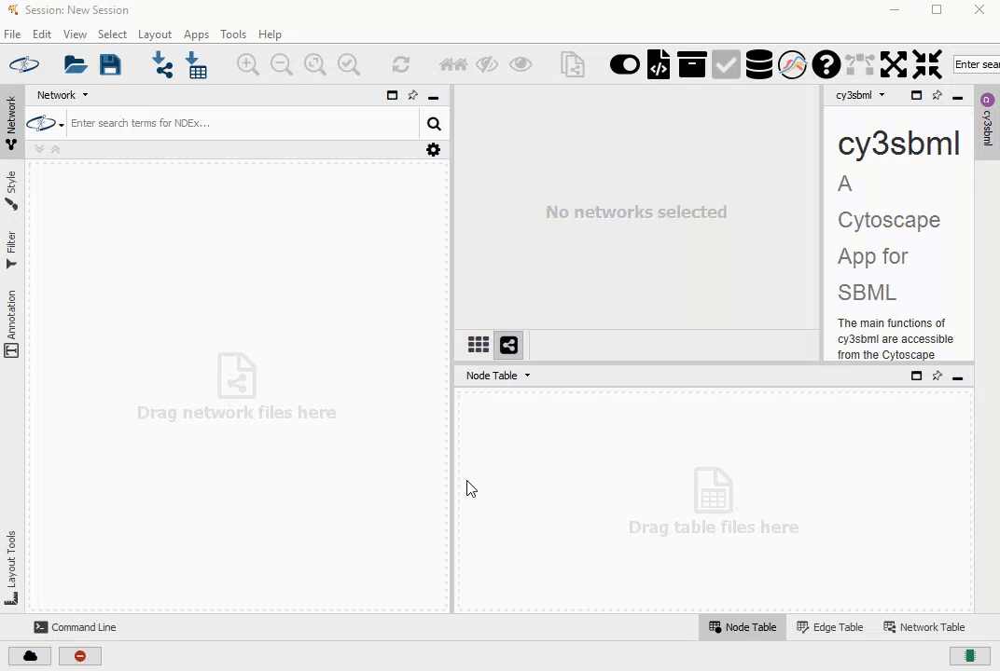

## Example COPASI Cytoscape application
This project hosts an example cytoscape application, that adds an importer for COPASI files to Cytoscape. The example borrows heavily from [cy3sbml](https://github.com/matthiaskoenig/cy3sbml/).  

### Building the app
Running: 

	mvn package

from the checked out project, will produce a file `./target/CopasiPlugin-1.0.jar`, that then can be manually added to cytoscape. For this to work, the native library of the COPASI Java bindings needs to be in the `java.library.path`. 

### Creating an artifact from the bindings
The COPASI bindings consist of a `copasi.jar` file and a corresponding shared library. To be able to use them the maven command: 

	mvn org.apache.maven.plugins:maven-install-plugin:2.5.2:install-file -Dfile=lib\copasi.jar -DgroupId=org.COPASI -DartifactId=copasi -Dversion=1 -Dpackaging=jar

was used, from there it is then picked up from the pom file, as the `lib` directory is marked as repository: 

    <repository>
      <id>in-project</id>
      <name>In project repository</name>
      <url>file://${project.basedir}/lib</url>
    </repository>

and then the file is included like so: 

    <dependency>
      <groupId>org.COPASI</groupId>
      <artifactId>copasi</artifactId>
      <version>1</version>
    </dependency>   

### License
The packages available on this page are provided under the 
[Artistic License 2.0](http://copasi.org/Download/License/), 
which is an [OSI](http://www.opensource.org/) approved license. This license 
allows non-commercial and commercial use free of charge.
 
